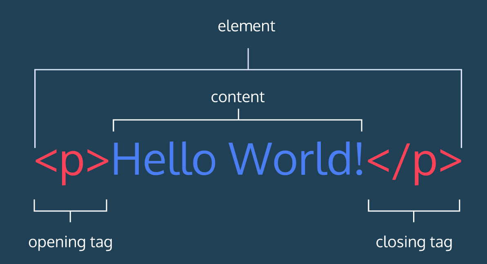

# HTML解析

## Table of Contents

- [引入](#引入)
- [HTML元素](#HTML元素)

## 引入

HTML有元素组成。这些元素构成网页的内容，我们来看看它们是如何书写的。

## HTML元素
下图是一个HTML的段落元素：

正如我们所看到的，段落元素由一个开始标签\<p\>, 内容("Hello, World"文本)和一个
结束标签\
组成。**HTML元素由标签及标签内的内容组成。即标签本身和标签内的内容称为HTML元素** 我们可以用很多不同的标签来
组成和展示文本和图像等非文本内容。

